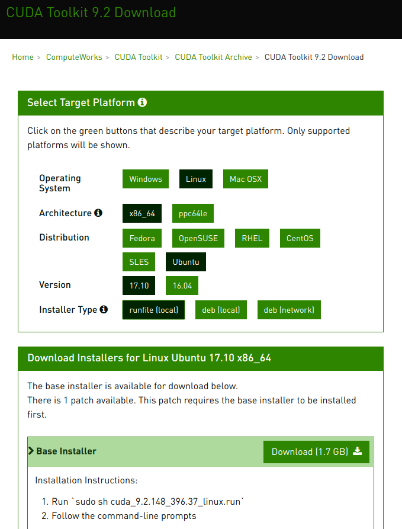
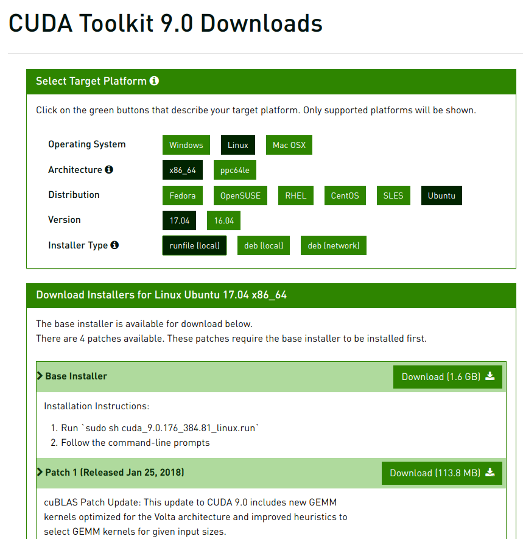

# Install cuda and cuDNN on ubuntu 18.04

## This contains step by step instructions to install cuda v9.0 and cudnn 7.2 (or 9.2 and 7.3) in ubuntu 18.04

### Steps 
- verify the system has a cuda-capable gpu
- download and install the nvidia cuda toolkit and cudnn
- setup environmental variables
- verify the installation
###

### Verify your gpu is cuda enable check

``` linux
lspci | grep -i nvidia
```
### Update the PPA repository driver
``` linux
sudo add-apt-repository ppa:graphics-drivers/ppa
```

### Install nvidia driver 
```
sudo apt install nvidia-410
```
Note: once you add the PPA, the latest driver should already be listed by default


### Install other import packages
```
sudo apt-get install g++ freeglut3-dev build-essential libx11-dev libxmu-dev libxi-dev libglu1-mesa libglu1-mesa-dev
```

### CUDA 9 requires gcc 6

gcc 7 compiler is installed by default in 18.02. 

To verify the version of gcc install enter
```
gcc --version
```
To install gcc version 6
```
sudo apt install gcc-6
sudo apt install g++-6
```

# Download one of the "runfile (local)" installation packages from cuda toolkit archive 

https://developer.nvidia.com/cuda-toolkit-archive

https://developer.nvidia.com/cuda-92-download-archive



https://developer.nvidia.com/cuda-90-download-archive



### Make the download file executable
chmod +x cuda_9.0.176_384.81_linux.run 
sudo ./cuda_9.0.176_384.81_linux.run --override

### Answer following questions while installation begin
- You are attempting to install on an unsupported configuration. Do you wish to continue? y
- Install NVIDIA Accelerated Graphics Driver for Linux-x86_64 384.81? n
- Install the CUDA 9.0 Toolkit? y

### Set up symlinks for gcc/g++
```
sudo ln -s /usr/bin/gcc-6 /usr/local/cuda/bin/gcc
sudo ln -s /usr/bin/g++-6 /usr/local/cuda/bin/g++
```

### Setup your paths
```
echo 'export PATH=/usr/local/cuda-9.0/bin:$PATH' >> ~/.bashrc
echo 'export LD_LIBRARY_PATH=/usr/local/cuda-9.0/lib64:$LD_LIBRARY_PATH' >> ~/.bashrc
source ~/.bashrc
```

I personally do not like updating the bash, rather I create a sourc file for respective cuda version and activate it as necessary

file: cuda90-env
```
export PATH=/usr/local/cuda-9.0/bin${PATH:+:${PATH}}
export LD_LIBRARY_PATH=/usr/local/cuda-9.0/lib64:${LD_LIBRARY_PATH:+:${LD_LIBRARY_PATH}}
```

file: cuda92-env
```
export PATH=/usr/local/cuda-9.2/bin${PATH:+:${PATH}}
export LD_LIBRARY_PATH=/usr/local/cuda-9.2/lib64:${LD_LIBRARY_PATH:+:${LD_LIBRARY_PATH}}
```
To use this path just type on the terminal 
```
source cuda90-env
```

### Install cuDNN v7.2 (for 9.0) or v7.3 (for 9.2)
In order to download cuDNN you have to be registered here https://developer.nvidia.com/developer-program/signup
then download cuDNN v7.2 (v7.3) form https://developer.nvidia.com/cudnn
```
CUDNN_TAR_FILE="cudnn-9.0-linux-x64-v7.2.1.38"
wget https://developer.nvidia.com/compute/machine-learning/cudnn/secure/v7.2.1/prod/9.0_20180806/${CUDNN_TAR_FILE}
tar -xzvf ${CUDNN_TAR_FILE}
```

### Copy the following files into the cuda toolkit directory.
```
sudo cp -P cuda/include/cudnn.h /usr/local/cuda-9.0/include
sudo cp -P cuda/lib64/libcudnn* /usr/local/cuda-9.0/lib64/
sudo chmod a+r /usr/local/cuda-9.0/lib64/libcudnn*
```

# Finally, to verify the installation, check
nvidia-smi
nvcc -V 
